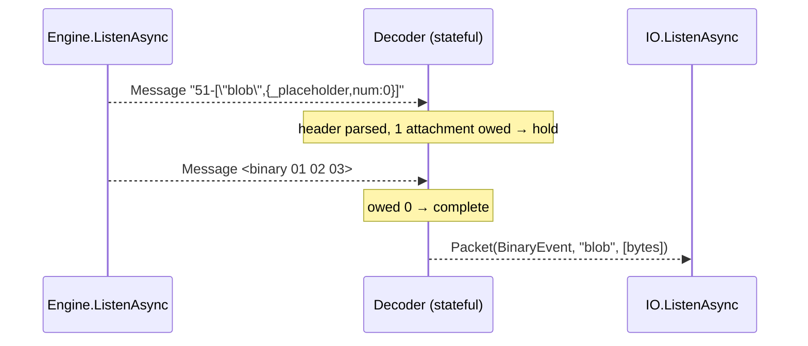

`Engine.ListenAsync` already hands you exactly the right input: `Message` packets in arrival order, each flagged `PlainText` or `Binary`. So the parser's input is a stream, not a buffer — and that's the one place the Engine.IO mirror breaks down.



`Packet.TryParse` on the Engine.IO side is a cast and a slice because an Engine.IO packet is self-contained. A Socket.IO binary packet spans several of them, so the job splits in two: a **pure** `TryParse` for one text frame, and a **stateful** `Decoder` that owns the "waiting for N attachments" state. Putting the second inside `TryParse` is the trap — it would make a parse call order-dependent.

```diff
 src/SocketIO.Client/
 ├── IO.cs                      # ListenAsync stops throwing; drains Engine + routes
 ├── Packets/
 │   ├── Packet.cs              # + static TryParse, + read-side payload accessors
 │   ├── PacketData.cs
 │   └── PacketType.cs
+│   └── Decoder.cs             # holds a binary header until its attachments land
 └── Exceptions/
+    └── PacketFormatException.cs
```

## The header scan

Straight left-to-right, each part optional but strictly ordered — `<type>[<n>-][<ns>,][<ackId>]<json>`:

```text
TryParse(bytes) -> bool
  type = bytes[0]                          reject unless 0x30..0x36

  if type is BinaryEvent or BinaryAck
    read digits up to '-'                  reject if no '-' or count < 1
    attachments = count

  if next byte is '/'
    read up to ',' or end of buffer        namespace, else "/"

  if next byte is a digit
    read digits                            ackId

  payload = rest                           empty for Connect/Disconnect
```

The `count < 1` rejection is the same rule that bit the encoder — worth mirroring so a malformed inbound frame fails here rather than three layers up.

## The stateful half

```text
Decoder.Add(enginePacket) -> Packet?
  if packet is binary
    if not reconstructing        -> throw   "binary with no header"
    pending.Attach(bytes)
    return pending.Complete ? Take() : null

  if reconstructing              -> throw   "header while reconstructing"

  if not Packet.TryParse(bytes, out p)  -> throw
  if p.Attachments == 0          -> return p
  pending = p; return null
```

Both throws matter: they're precisely the two errors socket.io's own decoder raises, and they're what the send-side lock exists to avoid producing. Treat them the way the server does — fatal to the connection, not to the message.

## The decision worth making first

`Packet` is currently write-only: `List<IPacketData>` accumulates items *to serialize*. Reading needs the inverse, and placeholders can't simply be substituted into JSON — bytes aren't JSON. So parse the payload array once into positional slots:

```csharp
// read side, alongside the existing write side
private JsonDocument? _payload;              // parsed once, owned by the packet
private readonly List<int> _binarySlots = [];  // arg index -> attachment index

public string? Event { get; }                 // already there; args[0] for events
public int Count { get; }
public bool IsBinary(int index);
public T? GetItem<T>(int index);              // deserialize on demand
public ReadOnlyMemory<byte> GetAttachment(int index);
```

Deserializing lazily is what lets the packet exist before its attachments do — and it keeps the `JsonTypeInfo<T>` seam (remaining item 9) a one-line change later instead of a rewrite.

Two things I'd settle before writing code: whether `Packet` carries both directions or reading gets its own type (mirroring Engine.IO says one type, but that `Packet` is a 3-field struct, not this), and whether `IO.ListenAsync` filters by namespace in the enumerator or fans out to a channel per namespace — item 4 leans on whichever you pick. Want me to draft either?